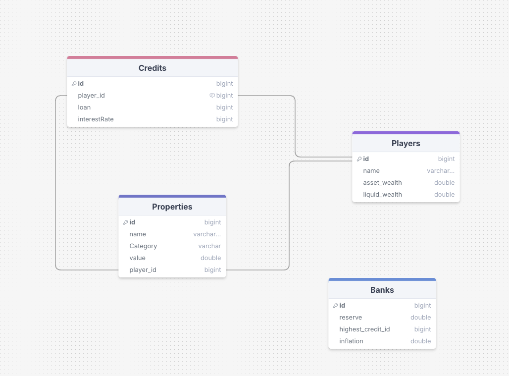

# real-monopoly

This repository should represent a monopoly game with a fractional reserve banking system. Players should use this application, as a bank, beside the real board game. The goal of this project is to showcase the problems with fractional reserve banking

## Documentation

### SQL database



## Setup

### Adding Dependencies

1. Download the `json` library from [Maven Repository](https://mvnrepository.com/artifact/org.json/json).
2. Place the downloaded JAR file in the `lib` directory.
3. Use the provided `Makefile` to build and run the project:
   ```sh
   make build
   make run
   ```
4. For testing:
   ```sh
   make build_test
   make run_test
   ```
